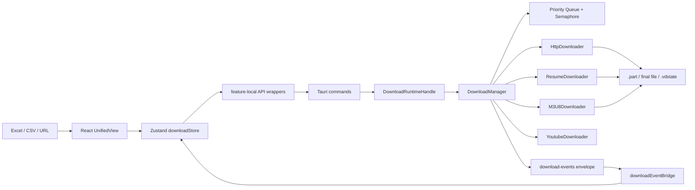

# Video Downloader Pro

[](https://github.com/seaworld008/tauri-video-batch-downloader/actions/workflows/ci.yml)
[](https://github.com/seaworld008/tauri-video-batch-downloader/actions/workflows/security.yml)
[](https://github.com/seaworld008/tauri-video-batch-downloader/actions/workflows/release.yml)


一个基于 **Tauri v2 + Rust + React 19 + TypeScript**
的跨平台桌面批量视频下载工具。项目聚焦真实批量下载场景：从 Excel/CSV 导入大量课程或媒体链接，统一进入可暂停、可续传、可观察、可恢复的下载队列。

> 当前仓库已经完成下载主链、批量导入、断点恢复、事件桥、状态同步和质量门禁的核心收敛。后续目标是在保持真实可用的基础上继续提升下载协议覆盖、跨平台发布体验和社区贡献友好度。

---

## 目录

- [亮点](#亮点)
- [核心功能](#核心功能)
- [架构速览](#架构速览)
- [文档入口](#文档入口)
- [快速开始](#快速开始)
- [常用命令](#常用命令)
- [质量保障](#质量保障)
- [社区协作](#社区协作)
- [当前路线](#当前路线)

---

## 亮点

- **Rust 下载核心**：下载队列、并发控制、断点续传、重试、速率限制和状态持久化都在后端统一管理。
- **真实批量导入**：支持 Excel/CSV 导入、字段识别、字段映射、导入预览和重复任务识别。
- **可解释恢复**：App 重启后保留任务和本地断点状态，但不会自动偷跑下载，等待用户明确操作。
- **事件驱动 UI**：Tauri 事件桥使用带 schema 的 `download-events`
  信道同步进度、状态和统计信息。
- **社区级工程化**：内置 CI、安全审计、Graphify 架构图谱、GitNexus 影响分析、Vitest 和 Rust 测试。
- **渐进式架构收敛**：从 brownfield 项目持续拆分核心模块，避免推倒重写造成下载主链回退。

---

## 核心功能

| 能力     | 当前支持                                                             |
| -------- | -------------------------------------------------------------------- |
| 批量导入 | Excel、CSV、字段映射、编码检测、无效行摘要、重复导入识别             |
| 任务管理 | 添加、删除、开始、暂停、恢复、取消、全部开始、全部暂停、失败重试     |
| 下载协议 | HTTP/HTTPS、M3U8/HLS、YouTube 信息与格式相关能力                     |
| 可靠性   | `.part` 文件、resume 快照、完成 marker、断点恢复、错误分类、重试策略 |
| 并发控制 | Tokio semaphore、优先级队列、并发调高即时补位、并发调低延迟收敛      |
| 可观察性 | 下载进度、速度、ETA、提交耗时、P95 commit、前后端日志                |
| 跨平台   | macOS、Windows、Linux 的 Tauri v2 桌面应用基线                       |

---

## 架构速览



Graphify 当前识别出的核心抽象包括
`DownloadManager`、`YoutubeDownloader`、`HttpDownloader`、`FileParser`、`ResumeDownloader`、`M3U8Downloader`
和
`DownloadRuntimeHandle`。GitNexus 影响分析显示，启动恢复、任务状态机、下载事件桥和导入任务创建是当前最重要的执行流。

---

## 文档入口

| 想了解什么                   | 跳转                                                                     |
| ---------------------------- | ------------------------------------------------------------------------ |
| 项目架构、功能设计、技术决策 | [架构与功能设计](docs/architecture-functional-design.md)                 |
| 当前真实状态与主链事实       | [当前状态](docs/current-state.md)                                        |
| 文档总目录和阅读顺序         | [文档导航](docs/index.md)                                                |
| 本地开发、测试、贡献流程     | [贡献指南](CONTRIBUTING.md)                                              |
| 构建 release 包              | [构建与发布](docs/build-release.md)                                      |
| 真实 App 回归测试方案        | [App 回归测试方案](docs/app-regression-test-plan-2026-05-06.md)          |
| GSD + Graphify 工作流        | [GSD + Graphify 工作流](docs/gsd-graphify-workflow.md)                   |
| 大型代码库接手分析           | [AI 接手分析报告](docs/large-codebase-ai-handoff-analysis-2026-05-06.md) |

---

## 快速开始

### 环境要求

| 工具      | 版本                                  |
| --------- | ------------------------------------- |
| Node.js   | >= 20                                 |
| pnpm      | >= 9                                  |
| Rust      | stable，建议 >= 1.78                  |
| Tauri CLI | v2，本仓库通过 `@tauri-apps/cli` 管理 |

### 安装依赖

```bash
pnpm install --frozen-lockfile
```

### 启动桌面开发模式

```bash
pnpm dev
```

### 构建应用

```bash
pnpm build
```

macOS release 产物默认生成到：

```text
src-tauri/target/release/bundle/macos/
src-tauri/target/release/bundle/dmg/
```

---

## 常用命令

```bash
# 前端类型检查与 lint
pnpm type-check
pnpm lint

# 前端测试
pnpm exec vitest run
pnpm test:integration

# Rust 检查
cargo fmt --manifest-path src-tauri/Cargo.toml --all --check
cargo clippy --manifest-path src-tauri/Cargo.toml -- -D warnings
cargo test --manifest-path src-tauri/Cargo.toml

# 安全与依赖
pnpm audit --audit-level high
./scripts/audit-rust.sh

# 全量质量门禁
pnpm test:all

# Graphify 增量同步
./scripts/graphify-sync.sh smart
```

---

## 质量保障

项目采用前后端双测试栈和图谱/影响分析协同：

- **Frontend**：Vitest + Testing
  Library，覆盖导入、任务创建、事件桥、工具栏和状态 reducer。
- **Backend**：`cargo test`
  覆盖下载器、队列、状态机、持久化恢复、断点文件、完整性校验。
- **Static checks**：TypeScript、ESLint、Rust fmt、Clippy。
- **Security**：GitHub Security Audit、`pnpm audit`、`cargo audit`。
- **Architecture
  intelligence**：Graphify 维护本地图谱，GitNexus 用于提交前影响分析。

当前发布前推荐最小门禁：

```bash
pnpm type-check
pnpm lint
pnpm exec vitest run
cargo fmt --manifest-path src-tauri/Cargo.toml --all --check
cargo clippy --manifest-path src-tauri/Cargo.toml -- -D warnings
cargo test --manifest-path src-tauri/Cargo.toml
pnpm build
```

---

## 社区协作

欢迎围绕这些方向贡献：

- 更多下载协议和站点适配
- M3U8 加密、断流、无 Range 服务端等边界场景
- Windows/Linux 打包体验
- 下载任务可视化、搜索、筛选和批量操作体验
- 文档、测试样例、真实回归案例

建议先阅读：

- [架构与功能设计](docs/architecture-functional-design.md)
- [贡献指南](CONTRIBUTING.md)
- [文档导航](docs/index.md)

---

## 当前路线

1. 继续强化下载状态机和恢复语义，确保任务不会丢、不会误重下、不会重启后自动偷跑。
2. 继续压缩前端状态同步路径，让 event + refresh +
   polling 逐步收敛到更清晰的主链。
3. 增强完成文件识别：在 `.vdstate`
   基础上逐步引入可选 ETag、hash、Content-Length 校验。
4. 扩展协议支持与真实站点适配，同时保持核心下载器可测试、可观察、可回滚。

---

如果你喜欢这个项目，欢迎 star、试用、提 issue，或者提交一个能让批量下载更稳的小 PR。
