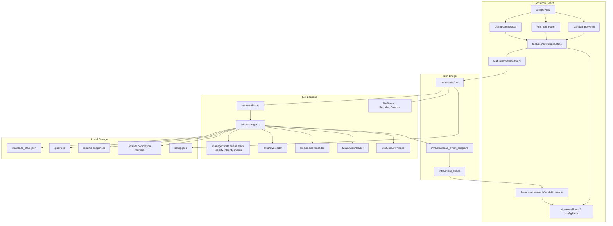
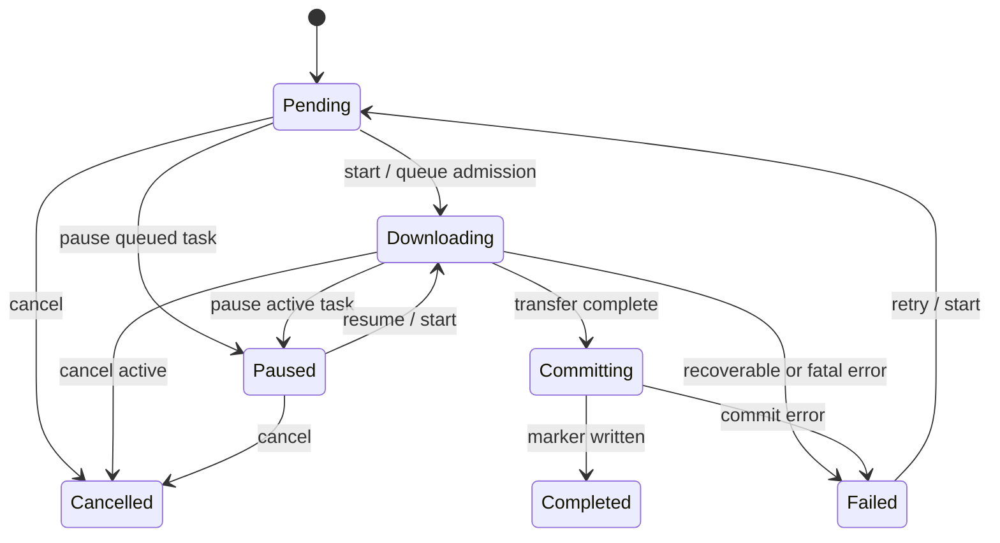
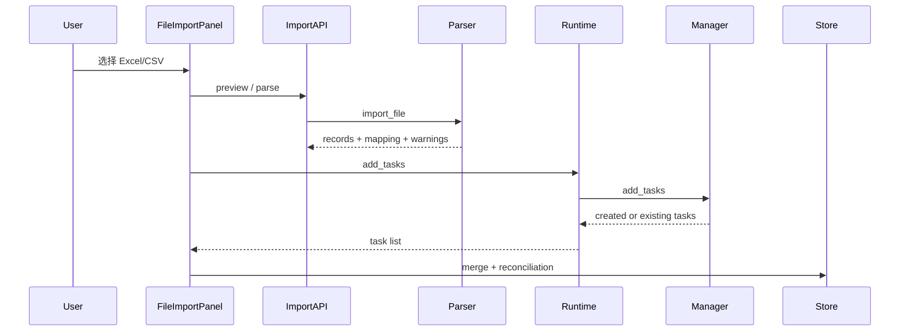

# Video Downloader Pro 架构与功能设计

更新日期：2026-05-06

本文档基于当前代码库、Graphify 图谱报告和 GitNexus 影响分析整理，目标是给维护者、贡献者和 AI
agent 一个专业、可落地、可验证的系统视图。它描述的是当前真实架构和近期演进方向，不是脱离实现的理想蓝图。

---

## 1. 项目定位

Video Downloader
Pro 是一个跨平台桌面批量视频下载工具。它不只是一个“输入 URL 后下载”的小工具，而是面向真实批量任务场景：

- 从 Excel/CSV 导入大量视频链接
- 为每个任务建立可追踪的业务身份
- 按并发策略调度下载
- 支持暂停、恢复、失败重试和断点续传
- 在 App 重启后保留任务、断点文件和完成状态
- 通过事件流把后端真实状态同步到前端 UI

核心设计原则：

1. **后端是真相源**：任务状态、下载进度、队列和文件状态以 Rust 后端为准。
2. **前端只做表达和编排**：前端可以发起操作和展示反馈，但不能抢先破坏性改写下载状态。
3. **恢复优先于自动化**：重启后保留任务和断点，但不自动偷跑下载，避免用户意外消耗带宽或覆盖文件。
4. **边界可测试**：下载状态机、导入合并、事件契约、路径生成和持久化恢复都必须有自动化测试。
5. **渐进收敛**：当前是 brownfield 项目，优先围绕主链拆边界，不用一次性重写。

---

## 2. 技术栈

| 层            | 技术                              | 责任                                         |
| ------------- | --------------------------------- | -------------------------------------------- |
| Desktop shell | Tauri v2                          | 跨平台窗口、命令桥、插件能力、打包           |
| Backend       | Rust + Tokio                      | 下载调度、并发、断点、文件写入、持久化、事件 |
| Frontend      | React 19 + TypeScript + Vite      | 任务操作、导入流程、状态展示、设置界面       |
| State         | Zustand v5                        | 前端运行时状态容器                           |
| Styling       | Tailwind CSS v4 + shadcn 风格约定 | 统一界面风格和交互状态                       |
| Validation    | Zod + TypeScript contracts        | 前端运行时事件/数据校验                      |
| Tests         | Vitest + cargo test               | 前后端单元/集成回归                          |
| Analysis      | Graphify + GitNexus               | 架构图谱、影响面分析、执行流理解             |

---

## 3. Graphify / GitNexus 分析摘要

Graphify 当前识别出 1520 个节点、2743 条边、67 个 community。最核心的 God
Nodes 是：

1. `DownloadManager`
2. `YoutubeDownloader`
3. `HttpDownloader`
4. `PerformanceBenchmark`
5. `FileParser`
6. `ResumeDownloader`
7. `M3U8Downloader`
8. `DeploymentVerifier`
9. `EncodingDetector`
10. `DownloadRuntimeHandle`

这些节点说明当前架构重心很清楚：下载管理器是核心调度中心，协议 downloader、导入 parser、事件桥和运行时 handle 围绕它展开。

GitNexus 的 compare/impact 分析把以下流程标为高影响区域：

- `DownloadManager.load_persisted_state`
- `DownloadRuntimeHandle` command router
- `spawn_download_event_bridge`
- `FileImportPanel` 和任务创建 reconciliation
- `manager/identity.rs` 中的任务身份与路径推导

这类“critical”评级代表它们影响启动、导入、下载、恢复和事件同步主链。当前对应风险已经通过自动化测试和真实 App 回归覆盖，但后续修改这些区域仍需先写测试再改实现。

---

## 4. 总体架构



---

## 5. 前端设计

### 5.1 主 UI 边界

当前正式入口集中在 `UnifiedView`：

- `src/components/Unified/UnifiedView.tsx`
- `src/components/Unified/ManualInputPanel.tsx`
- `src/components/Unified/FileImportPanel.tsx`
- `src/components/Downloads/DashboardToolbar.tsx`
- `src/components/Downloads/DownloadStartConfirmDialog.tsx`
- `src/components/Downloads/DeleteTasksConfirmDialog.tsx`

设计要点：

- `UnifiedView` 是当前主工作台，不再以旧的多视图分叉为主线。
- 导入、添加链接、批量控制、筛选和设置入口都围绕任务队列展开。
- 下载前会弹出保存位置确认，避免批量任务写错目录。
- 重复导入同一表格时，通过 reconciliation 区分新增任务和已有任务。

### 5.2 Feature-local API

前端不直接到处调用 `invoke`，而是通过 `src/features/downloads/api/*` 收敛：

- `downloadCommands.ts`
- `importCommands.ts`
- `configCommands.ts`
- `runtimeQueries.ts`
- `taskCreation.ts`
- `taskMutations.ts`
- `systemCommands.ts`

价值：

- 命令名称集中管理
- 参数和返回值更容易测试
- UI 组件不用知道 Tauri command 细节
- 后续替换 runtime 或命令签名时影响面更小

### 5.3 状态编排

`src/features/downloads/state/*`
负责把“用户动作”转为“后端命令 + 前端状态补丁 + 反馈消息”：

- `taskCreationOrchestration.ts`：创建任务的输入、后端响应、状态 patch、消息摘要
- `taskCreationState.ts`：任务合并、重复识别、成功消息
- `downloadEventBridge.ts`：Tauri 事件监听和节流
- `eventReducers.ts`：进度/状态事件 reducer
- `runtimeSync.ts`：后端 truth refresh
- `batchControlEffects.ts`、`commandControlEffects.ts`：批量开始/暂停等操作

约束：

- React 组件中不要 destructure Zustand store；使用 selector。
- async callback 或事件 listener 内优先使用 `useDownloadStore.getState()`。
- 前端不要直接把显式暂停操作立即写成 `paused`，应等待后端事件或 refresh。

---

## 6. 后端设计

### 6.1 Runtime command router

`src-tauri/src/core/runtime.rs` 提供 `DownloadRuntimeHandle`，它是 Tauri
command 到 `DownloadManager` 的串行化入口。

主要命令：

- `AddTasks`
- `UpdateTaskOutputPaths`
- `RemoveTasks`
- `ClearCompleted`
- `RetryFailed`
- `UpdateConfig`
- `SetRateLimit`
- `Start` / `Pause` / `Resume` / `Cancel`
- `StartAll` / `PauseAll`
- `ApplyEvent`

设计目的：

- 避免多个 UI 操作同时持有 manager mutable guard
- 降低 async deadlock 风险
- 让命令执行顺序可解释
- 在下载事件返回时同步 manager 状态

### 6.2 DownloadManager

`DownloadManager` 是当前下载核心。Graphify 显示它是连接最多的核心抽象。

主要职责：

- 任务表 `tasks`
- 活跃下载表 `active_downloads`
- 优先级队列 `task_queue`
- Tokio semaphore 并发控制
- 队列暂停状态 `queue_paused`
- 下载统计 `stats`
- 任务生命周期指标
- 持久化恢复 `download_state.json`
- 完成 marker 和本地文件 hydrate
- HTTP / Resume / M3U8 / YouTube downloader 协调

为降低单文件压力，当前已拆出若干 manager 子模块：

- `manager/state.rs`：状态流转规则
- `manager/queue.rs`：队列入队、出队和补位
- `manager/stats.rs`：统计聚合
- `manager/identity.rs`：任务身份、输出路径和重复识别
- `manager/integrity.rs`：完整性校验
- `manager/events.rs`：事件发送辅助

后续应继续沿这些边界拆分，不建议新增逻辑继续堆进 `manager.rs`。

### 6.3 下载执行器

| 模块                    | 职责                                        |
| ----------------------- | ------------------------------------------- |
| `downloader.rs`         | HTTP 下载、连接、重试、进度                 |
| `resume_downloader.rs`  | Range 断点续传、chunk、resume metadata      |
| `m3u8_downloader.rs`    | HLS playlist、segment、key/IV 解析          |
| `youtube_downloader.rs` | YouTube URL、视频信息、格式选择             |
| `part_file.rs`          | `.part` 文件预分配、范围写入、commit rename |
| `integrity_checker.rs`  | hash 和完整性校验                           |
| `progress_tracker.rs`   | 速度、ETA、统计窗口                         |

下载暂停时，后端必须确保 `.part`
缓冲 flush/sync，再退出任务，避免半下载文件损坏。

---

## 7. 任务状态机



关键规则：

- `Downloading` 和 `Committing` 是活跃状态，不能重复 start。
- `Completed` 和 `Cancelled` 是终态，不应被普通 start/resume 重新激活。
- `Failed` 可以通过 retry 或 start 回到 `Pending`。
- `Committing` 用于保护文件落盘阶段，避免进度 100% 但最终文件还没安全写完。
- App 启动发现上次 `Downloading`，会转成 `Paused`，不自动入队。

---

## 8. 导入与任务身份设计

### 8.1 导入流程



### 8.2 重复识别

重复导入同一张表时，系统不应该重复创建任务，也不应该只提示“成功添加”。当前前端会生成 reconciliation 摘要：

- `createdCount`
- `existingCount`
- `completedCount`
- `resumableCount`
- `pendingCount`
- `failedCount`

这样用户能明确知道：

- 哪些是新任务
- 哪些已经存在
- 哪些已完成
- 哪些可以续传
- 哪些仍在等待或失败

### 8.3 输出路径与业务身份

`manager/identity.rs` 负责：

- 输出目录规范化
- 文件名推导
- URL / 标题 / 输出路径组合身份
- 任务重复查找
- resume key 构造

这块影响导入、重复识别、恢复和文件覆盖安全，后续修改必须覆盖：

- 同 URL 不同课程
- 同课程同 URL 不同目录
- 标题为空
- 文件名非法字符
- Windows 保留名
- 已完成 marker 与本地文件同时存在

---

## 9. 持久化与恢复

本地状态由几类文件共同构成：

| 文件                  | 作用                             |
| --------------------- | -------------------------------- |
| `download_state.json` | 任务列表、队列状态、queue paused |
| `.part`               | 未完成下载内容                   |
| resume metadata       | chunk/range 续传信息             |
| `.vdstate`            | 下载完成 marker                  |
| `config.json`         | 用户配置                         |

启动恢复策略：

1. 读取 persisted manager state。
2. 把遗留 `Downloading` 安全转换为 `Paused`。
3. 清空启动队列，不自动重新入队。
4. 如果有可恢复任务，保持 `queue_paused = true`。
5. hydrate 本地文件状态和完成 marker。
6. 等用户点击“全部开始”或单任务开始后再恢复下载。

这是下载器行业中更稳妥的持久 session 模型：保留上下文，但不替用户做会消耗网络和写文件的动作。

---

## 10. 事件与状态同步

### 10.1 后端事件

事件统一通过 `src-tauri/src/infra/event_bus.rs`：

- channel：`download-events`
- schema version：`1`
- envelope 字段：`schema_version`、`event_id`、`event_type`、`ts`、`payload`

当前支持事件：

- `task.progressed`
- `task.status_changed`
- `task.stats_updated`

### 10.2 前端消费

`src/features/downloads/state/downloadEventBridge.ts` 负责监听事件：

- 校验 envelope schema
- 校验 event type 和 payload
- 对 progress 事件做 UI 节流
- 对 status 事件用 reducer 更新任务
- 对 stats 事件合并统计
- 保留 runtime sync fallback，处理事件丢失或窗口恢复场景

事件桥是前后端状态一致性的核心。任何事件字段调整都必须同时更新：

- Rust `event_bus.rs`
- Rust `download_event_bridge.rs`
- TypeScript `model/contracts.ts`
- `downloadEventBridge.test.ts`
- `contracts.test.ts`

---

## 11. 配置与能力探测

配置由 `AppConfig` 和前端 `configStore`
共同表达，但真实下载配置最终落到 Rust 后端。

关键配置：

- 并发下载数
- 重试次数
- 超时时间
- 默认下载目录
- User-Agent
- 代理
- 主题、语言、通知等 UI 设置

能力探测集中在：

- `src-tauri/src/commands/system.rs`
- `src-tauri/src/infra/capability_service.rs`

外部工具如 `yt-dlp`、`ffmpeg`
等后续接入时，应在 capability 层统一探测和提示，避免 UI 直接假设工具存在。

---

## 12. 安全与可靠性设计

### 12.1 URL 和输入

- 下载 URL 必须限制为 HTTP/HTTPS 或已明确支持的平台 URL。
- 文件名必须做跨平台 sanitize。
- Excel/CSV 解析结果不能直接作为文件路径使用。
- 错误信息可读，但不应泄露 token、cookie 或代理认证信息。

### 12.2 文件写入

- 下载先写 `.part`，完成后 commit 到最终文件。
- 暂停/取消活跃下载时必须 flush/sync。
- 完成状态依赖 `.vdstate` marker，避免只凭同名文件误判完成。
- 不支持 Range 的服务端需要明确降级或重新下载策略。

### 12.3 并发与锁

- 不要在持有 `std::sync::Mutex/RwLock` guard 时 `.await`。
- 核心 async 状态优先使用 Tokio 锁或缩小锁作用域。
- 调低并发时不强杀活跃任务，而是延迟收敛 semaphore。

---

## 13. 测试策略

### 13.1 必跑门禁

```bash
pnpm type-check
pnpm lint
pnpm exec vitest run
cargo fmt --manifest-path src-tauri/Cargo.toml --all --check
cargo clippy --manifest-path src-tauri/Cargo.toml -- -D warnings
cargo test --manifest-path src-tauri/Cargo.toml
pnpm build
```

### 13.2 核心回归维度

- 导入同一 Excel 不重复创建
- 已完成、可续传、等待、失败任务的导入摘要准确
- 启动恢复不自动下载
- 显式全部开始按并发数启动
- 全部暂停后活跃下载归零
- 并发 3 -> 1 不强杀活跃任务
- 并发 1 -> 4 队列补位
- `download-events` schema 稳定
- 失败任务可以 retry
- 完成 marker 能跨会话识别

真实 App 回归方案见 `docs/app-regression-test-plan-2026-05-06.md`。

---

## 14. 发布与社区展示

发布路径：

1. 通过质量门禁。
2. 运行 `pnpm build` 生成 Tauri release 包。
3. 检查 macOS `.app` 和 `.dmg`。
4. Windows/Linux 产物通过 release workflow 或对应平台构建。
5. 发布说明必须包含：新增能力、修复问题、已知风险、升级建议。

社区展示重点：

- README 第一屏应说明项目是什么、能解决什么问题、为什么可信。
- 文档入口要能快速跳到架构、开发、测试、发布。
- GitHub topics 应覆盖
  `tauri`、`rust`、`react`、`video-downloader`、`m3u8`、`hls` 等关键词。
- Issues 应鼓励真实下载场景、协议扩展、平台打包、可访问性和性能反馈。

---

## 15. 后续优化路线

### P0：稳定性

- 持续强化状态机测试。
- 补充无 Range、429、断网、磁盘权限、文件损坏等下载边界。
- 保持启动恢复不自动下载的原则。

### P1：协议和平台

- 增强 M3U8 加密场景。
- 更系统地接入 `yt-dlp`/`ffmpeg` sidecar。
- 完善 Windows/Linux release 验证。

### P2：产品体验

- 更清晰的“上次会话恢复”提示。
- 下载任务分组、标签、批量筛选。
- 更丰富的错误诊断和一键复制报告。

### P3：社区工程

- 持续维护 issue templates、PR template、labels、Discussions 和 Wiki。
- 补充演示截图或短视频。
- 明确 license。
- 定期更新 Graphify/GitNexus 分析摘要。

---

## 16. 维护约定

- 新增下载核心行为必须 test-first。
- 修改事件协议必须同步 Rust/TypeScript contracts。
- 修改导入身份规则必须补重复导入和输出路径测试。
- 修改并发调度必须跑 Rust manager/queue 相关测试。
- 文档应优先写当前真实行为，再写路线图。
- Graphify/GitNexus 结果是辅助判断，不替代测试和真实 App 验证。
