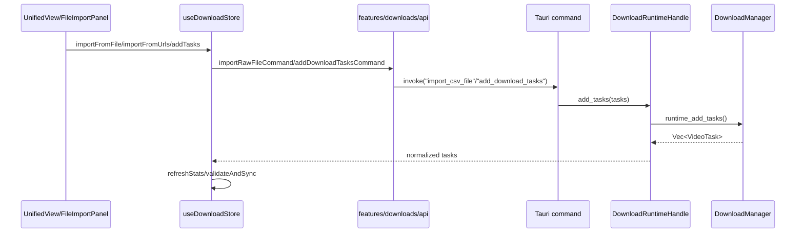
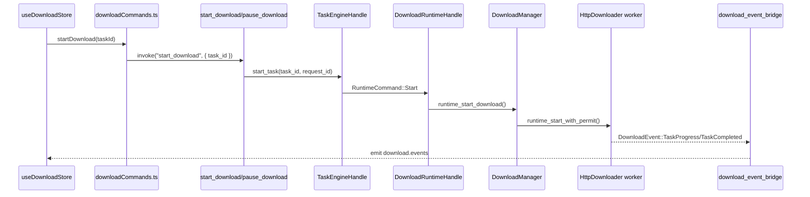
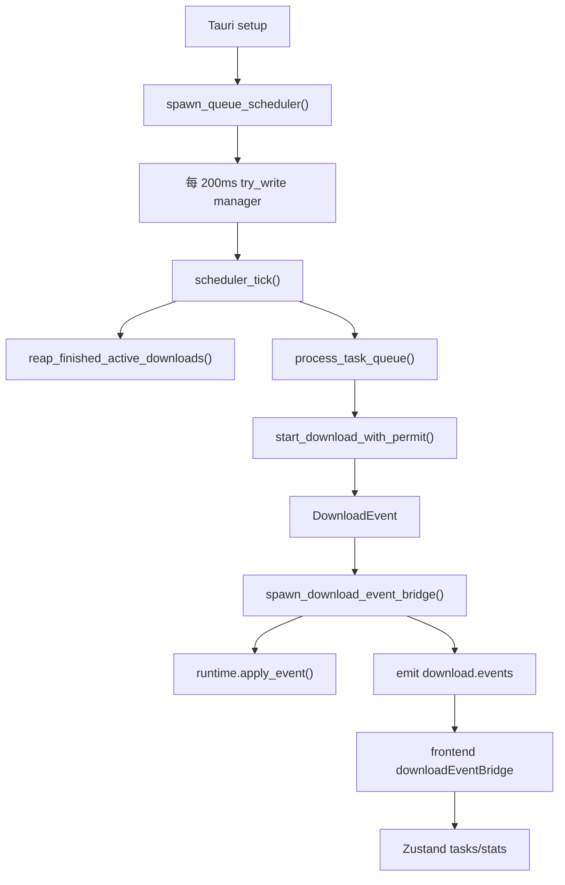
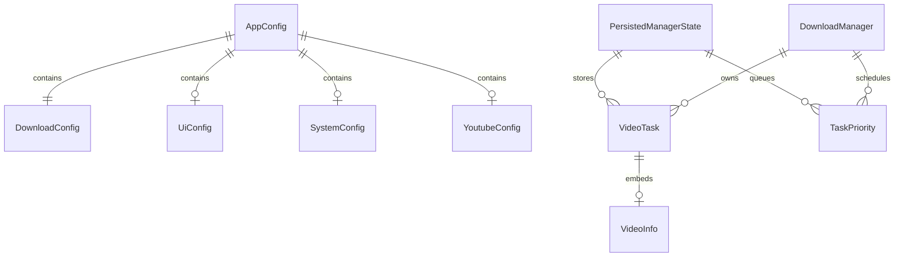
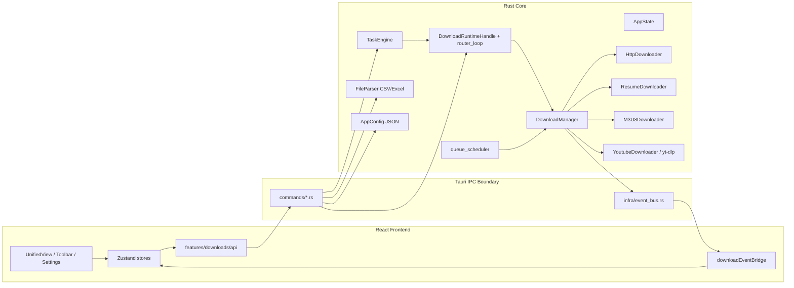
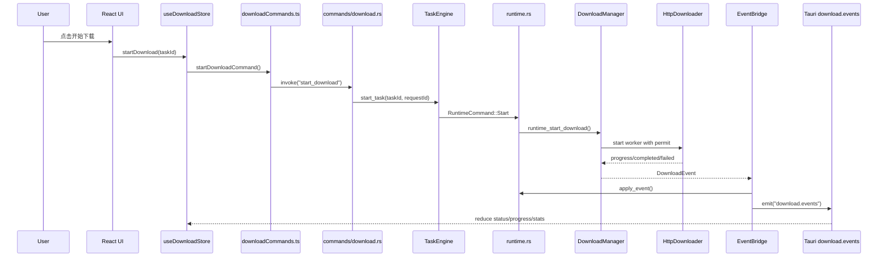

# 大型项目代码库 AI 接手分析报告

生成时间：2026-05-06
分析范围：`/Volumes/soft/10-codex/006-tauri-video-batch-downloader`
分析方式：GitNexus 索引刷新 + GitNexus MCP 查询 +
graphify 结构图谱 + 本地源码扫描。

## 1. 项目是做什么的

这是一个跨平台桌面端批量视频下载器，产品名为
`Video Downloader Pro`。前端负责导入 URL/CSV/Excel、展示下载队列、批量控制任务和设置下载目录；后端通过 Tauri
IPC 提供下载任务管理、配置管理、文件导入、视频信息探测、日志落盘等能力。

依据：

- `package.json:2-4` 定义项目名 `video-downloader-pro` 与描述。
- `src-tauri/Cargo.toml:1-8` 定义 Rust/Tauri 后端包名、版本、默认二进制。
- `src-tauri/tauri.conf.json:30-34`
  声明应用描述支持 YouTube、M3U8、HTTP 直链下载。
- `src-tauri/src/main.rs:220-254` 注册所有 Tauri IPC 命令。

## 2. 技术栈

| 层       | 技术                                           | 依据                                                                                       |
| -------- | ---------------------------------------------- | ------------------------------------------------------------------------------------------ |
| 桌面壳   | Tauri v2                                       | `src-tauri/Cargo.toml:15`、`src-tauri/tauri.conf.json:1-7`                                 |
| 后端     | Rust 2021、Tokio、Reqwest、Tracing             | `src-tauri/Cargo.toml:6`、`src-tauri/Cargo.toml:19-30`、`src-tauri/Cargo.toml:52-57`       |
| 前端     | React 19、Vite 7、TypeScript、Tailwind CSS 4   | `package.json:48-49`、`package.json:59-84`                                                 |
| 状态管理 | Zustand v5                                     | `package.json:56`、`src/stores/downloadStore.ts:1-2`                                       |
| 数据校验 | Zod                                            | `package.json:55`、`src/schemas/*`                                                         |
| 测试     | Vitest、Testing Library、cargo test/clippy/fmt | `package.json:17-23`、`.github/workflows/ci.yml:51-67`、`.github/workflows/ci.yml:109-125` |
| 打包发布 | Tauri build、GitHub Actions                    | `package.json:11-13`、`.github/workflows/ci.yml:128-195`                                   |

## 3. 目录结构

| 目录/文件                       | 功能                                                                                              |
| ------------------------------- | ------------------------------------------------------------------------------------------------- |
| `src/main.tsx`                  | 前端 React 根入口，挂载 `ErrorBoundary`、React Query、ThemeProvider、App。见 `src/main.tsx:42-55` |
| `src/App.tsx`                   | 前端应用启动协调，初始化事件桥、配置与下载 store。见 `src/App.tsx:16-36`                          |
| `src/components/Unified/`       | 当前主视图与导入/手动输入/状态栏组件                                                              |
| `src/components/Downloads/`     | 下载工具栏、批量控制、确认弹窗                                                                    |
| `src/features/downloads/api/`   | 前端 feature-local Tauri IPC 封装                                                                 |
| `src/features/downloads/state/` | 下载 feature 的 store 副作用、事件 reducer、runtime sync、批量操作等编排                          |
| `src/stores/`                   | Zustand stores：下载、配置、UI 通知                                                               |
| `src/schemas/`                  | 前端运行时 schema 与类型导出                                                                      |
| `src-tauri/src/main.rs`         | Tauri 桌面应用真实运行入口                                                                        |
| `src-tauri/src/lib.rs`          | Rust library 导出与测试入口，部分与 `main.rs` 的 AppState 存在重复                                |
| `src-tauri/src/commands/`       | Tauri IPC 命令：download/import/config/system/youtube                                             |
| `src-tauri/src/core/`           | 下载核心：manager、runtime、downloader、resume、M3U8、YouTube、解析、错误、完整性                 |
| `src-tauri/src/engine/`         | `TaskEngine`，为 start/pause/resume/cancel 提供 request_id 去重与命令串行化                       |
| `src-tauri/src/infra/`          | 事件总线、事件桥、命令错误、工具能力探测                                                          |
| `.github/workflows/`            | CI、release、安全审计                                                                             |
| `docs/`                         | 架构、计划、评审、交接文档                                                                        |
| `graphify-out/`                 | 本地 graphify 图谱产物，默认不入库                                                                |

## 4. 每个模块的功能

### 前端模块

- `src/main.tsx`：注册全局 `error` 和 `unhandledrejection` 监听，创建 React
  Query client，挂载应用。依据 `src/main.tsx:13-25`、`src/main.tsx:27-55`。
- `src/App.tsx`：启动时调用
  `initializeDownloadEventBridge()`、`loadConfig()`、`initializeStore()`，启动完成后渲染
  `UnifiedView`、`NotificationCenter`、`Toaster`。依据 `src/App.tsx:16-62`。
- `src/stores/downloadStore.ts`：核心前端状态容器，包含任务列表、下载配置、统计、导入状态、校验状态、筛选排序、任务控制动作。接口定义集中在
  `src/stores/downloadStore.ts:108-246`，实现从
  `src/stores/downloadStore.ts:248` 开始。
- `src/features/downloads/api/*.ts`：前端 IPC facade，例如
  `startDownloadCommand()` 调用 `start_download`，`pauseDownloadCommand()` 调用
  `pause_download`。依据 `src/features/downloads/api/downloadCommands.ts:1-20`。
- `src/features/downloads/state/downloadEventBridge.ts`：监听后端
  `download.events`，解析 envelope 后更新 Zustand
  store；进度事件按 1000ms 节流，并每 1500ms 主动同步 runtime 状态。依据
  `src/features/downloads/state/downloadEventBridge.ts:28-190`。

### 后端模块

- `src-tauri/src/main.rs`：桌面应用真实入口，注册 Tauri 插件、IPC 命令、router
  loop、event bridge、queue scheduler。依据 `src-tauri/src/main.rs:212-323`。
- `src-tauri/src/commands/download.rs`：下载 IPC 命令面，包含 add/update/start/pause/resume/cancel/batch/stat/rate
  limit。命令清单见 `src-tauri/src/commands/download.rs:28-358`。
- `src-tauri/src/commands/import.rs`：CSV/Excel 导入命令，`import_csv_file()` 与
  `import_excel_file()` 都委托到 `import_file()`，再进入 `FileParser`。依据
  `src-tauri/src/commands/import.rs:71-190`、`src-tauri/src/commands/import.rs:220-260`。
- `src-tauri/src/commands/config.rs`：配置读写、重置、导入导出；更新配置后通过
  `download_runtime.update_config()` 同步下载管理器。依据
  `src-tauri/src/commands/config.rs:17-88`、`src-tauri/src/commands/config.rs:109-153`。
- `src-tauri/src/commands/system.rs`：打开下载目录、视频信息探测、前端日志落盘；视频信息优先 YouTube 内部逻辑，再尝试
  `yt-dlp`、`youtube-dl`，最后基础 URL 标题提取。依据
  `src-tauri/src/commands/system.rs:17-53`、`src-tauri/src/commands/system.rs:147-240`。
- `src-tauri/src/core/runtime.rs`：下载 runtime router，使用 `mpsc` + `oneshot`
  串行化命令，路由到 `DownloadManager::runtime_*`。依据
  `src-tauri/src/core/runtime.rs:15-70`、`src-tauri/src/core/runtime.rs:72-197`、`src-tauri/src/core/runtime.rs:263-368`。
- `src-tauri/src/engine/task_engine.rs`：对 start/pause/resume/cancel 提供
  `request_id` 去重与 ACK 语义，再委托 `DownloadRuntimeHandle`。依据
  `src-tauri/src/engine/task_engine.rs:31-164`。
- `src-tauri/src/core/manager.rs`：下载业务核心，拥有
  `tasks`、`active_downloads`、`download_semaphore`、`task_queue`、`rate_limit`、`retry_executor`、`integrity_checker`
  等状态。依据 `src-tauri/src/core/manager.rs:199-260`。
- `src-tauri/src/core/queue_scheduler.rs`：每 200ms 尝试获取 manager 写锁，调用
  `scheduler_tick()` 填充空闲下载槽。依据
  `src-tauri/src/core/queue_scheduler.rs:7-23`。
- `src-tauri/src/infra/download_event_bridge.rs`：从 `DownloadManager` event
  receiver 获取事件，先调用 runtime apply event 同步后端状态，再向 webview 发
  `download.events`。依据 `src-tauri/src/infra/download_event_bridge.rs:9-73`。
- `src-tauri/src/infra/event_bus.rs`：统一 event envelope，字段包含
  `schema_version`、`event_id`、`event_type`、`ts`、`payload`。依据
  `src-tauri/src/infra/event_bus.rs:10-36`。

## 5. 启动入口

### 开发/构建入口

- `pnpm dev` 实际执行 `tauri dev`。依据 `package.json:6-8`。
- `pnpm build` 执行 `tauri build`。依据 `package.json:11`。
- Tauri 开发时先跑 `pnpm vite`，构建时先跑 `pnpm vite build`，dev URL 为
  `http://localhost:1420`。依据 `src-tauri/tauri.conf.json:1-7`。

### 前端入口

`src/main.tsx` -> `App` -> `UnifiedView`。`App` 初始化顺序：

1. `initializeDownloadEventBridge()`。
2. `loadConfig()`。
3. `initDownloadStore()`。
4. 渲染主界面。

依据：`src/App.tsx:16-36`、`src/App.tsx:50-62`。

### 后端入口

`src-tauri/src/main.rs:195` 的 `main()` 是真实桌面入口。启动流程：

1. Windows 下检查/引导 WebView2。见 `src-tauri/src/main.rs:196-201`。
2. 初始化 tracing。见 `src-tauri/src/main.rs:204-205`。
3. 构造 `AppState`。见 `src-tauri/src/main.rs:209-210`。
4. 注册 Tauri 插件。见 `src-tauri/src/main.rs:212-218`。
5. 注册 IPC 命令。见 `src-tauri/src/main.rs:220-254`。
6. `setup()` 中启动 router loop、event bridge、download manager、queue
   scheduler。见 `src-tauri/src/main.rs:256-323`。

## 6. 核心业务流程

### 6.1 导入/手动创建任务

关键依据：

- 前端 store 的 `addTasks()` 使用 `executeTaskCreationStoreAction()`。见
  `src/stores/downloadStore.ts:308-344`。
- Rust `add_download_tasks()` 委托 `download_runtime.add_tasks()`。见
  `src-tauri/src/commands/download.rs:28-36`。
- Runtime `AddTasks` 路由到 `DownloadManager::runtime_add_tasks()`。见
  `src-tauri/src/core/runtime.rs:276-280`。

### 6.2 单任务启动/暂停/恢复/取消

关键依据：

- `start_download()` 生成或接收 `request_id`，通过
  `state.task_engine.start_task()` 执行。见
  `src-tauri/src/commands/download.rs:57-94`。
- `TaskEngine` 对重复 `request_id` 拒绝。见
  `src-tauri/src/engine/task_engine.rs:116-164`。
- `RuntimeCommand::Start` 路由到 `runtime_start_download()`。见
  `src-tauri/src/core/runtime.rs:314-326`。
- `runtime_start_download()`
  会检查任务状态、并发上限、信号量，超限时入队并返回并发错误。见
  `src-tauri/src/core/manager.rs:1580-1685`。

### 6.3 队列调度与事件同步

关键依据：

- `spawn_queue_scheduler()` 每 200ms tick。见
  `src-tauri/src/core/queue_scheduler.rs:7-23`。
- `scheduler_tick()` 调用 `reap_finished_active_downloads()` 与
  `process_task_queue()`。见 `src-tauri/src/core/manager.rs:1952-1959`。
- event bridge 先后端 apply event，再 emit 到前端。见
  `src-tauri/src/infra/download_event_bridge.rs:18-67`。
- 前端 `listen('download.events')` 后按 `event_type` 更新任务与统计。见
  `src/features/downloads/state/downloadEventBridge.ts:88-133`。

## 7. API 接口和权限体系

该项目没有 HTTP REST API。外部调用面主要是 Tauri IPC 命令。

### 7.1 IPC 命令清单

| 分类 | 命令                                                                                                                                                                                                                                                                                                                                                |
| ---- | --------------------------------------------------------------------------------------------------------------------------------------------------------------------------------------------------------------------------------------------------------------------------------------------------------------------------------------------------- |
| 下载 | `add_download_tasks`、`update_task_output_paths`、`start_download`、`pause_download`、`resume_download`、`cancel_download`、`pause_all_downloads`、`start_all_downloads`、`remove_download`、`remove_download_tasks`、`get_download_tasks`、`get_download_stats`、`clear_completed_tasks`、`retry_failed_tasks`、`set_rate_limit`、`get_rate_limit` |
| 导入 | `import_file`、`import_csv_file`、`import_excel_file`、`detect_file_encoding`、`preview_import_data`、`get_supported_formats`                                                                                                                                                                                                                       |
| 配置 | `get_config`、`update_config`、`reset_config`、`export_config`、`import_config`                                                                                                                                                                                                                                                                     |
| 系统 | `open_download_folder`、`get_video_info`、`log_frontend_event`                                                                                                                                                                                                                                                                                      |

依据：`src-tauri/src/main.rs:220-254`、`src-tauri/src/commands/*.rs`。

### 7.2 权限体系

- 当前 Tauri capability 文件是 `src-tauri/capabilities/migrated.json`。
- 该文件只声明 `core:default` 和 `dialog:default`。依据
  `src-tauri/capabilities/migrated.json:8-10`。
- 后端实际注册了 `dialog/fs/os/shell/process/mcp-bridge` 插件。依据
  `src-tauri/src/main.rs:212-218`。
- 前端生产代码目前确认使用 `@tauri-apps/plugin-dialog` 打开文件/目录选择。依据
  `src/features/downloads/api/importCommands.ts:1`、`src/features/downloads/api/importCommands.ts:85`、`src/features/downloads/api/systemCommands.ts:1`、`src/features/downloads/api/systemCommands.ts:27`。
- 未发现登录、账号、角色、JWT、RBAC 或多租户权限体系。结论：这是单机桌面应用，不是多用户服务端系统。

风险提示：如果未来前端生产代码直接使用 fs/shell/os/process 插件命令，需要同步更新
`src-tauri/capabilities/migrated.json`，否则 Tauri v2 权限可能阻断调用。

## 8. 数据库表和实体关系

未发现 SQL
migration、ORM、数据库连接配置，也未发现 PostgreSQL/MySQL/SQLite 业务表定义。`Cargo.lock`
中出现
`rusqlite/libsqlite3-sys`，但这是依赖树里的间接依赖；没有在源码中发现业务数据库访问。

当前持久化实体主要是本地 JSON：

| 实体                    | 位置                                                           | 说明                                                                                                            |
| ----------------------- | -------------------------------------------------------------- | --------------------------------------------------------------------------------------------------------------- |
| `VideoTask`             | `src-tauri/src/core/models.rs`                                 | 下载任务，包含 `id/url/title/output_path/status/progress/file_size/downloaded_size/error_message/video_info` 等 |
| `DownloadConfig`        | `src-tauri/src/core/models.rs`                                 | 下载并发、重试、超时、headers、输出目录、完整性校验配置                                                         |
| `AppConfig`             | `src-tauri/src/core/config.rs`                                 | 应用配置总根，包含 download/ui/system/youtube/advanced                                                          |
| `PersistedManagerState` | `src-tauri/src/core/manager.rs`                                | manager 本地状态，保存 tasks、queue、queue_paused                                                               |
| `download_state.json`   | `AppConfig::get_data_dir()/download_state.json`                | `DownloadManager::default_state_path()` 生成，见 `src-tauri/src/core/manager.rs:390-393`                        |
| `config.json`           | `ProjectDirs::from("com","videodownloader","pro")/config.json` | `AppConfig::get_config_path()` 生成                                                                             |

实体关系可理解为：

## 9. Redis、MQ、Nacos、XXL-JOB、Elasticsearch 等中间件

未发现实际使用：

- Redis：未发现 `redis` 客户端或连接配置。
- MQ/Kafka/RabbitMQ：未发现。
- Nacos：未发现。
- XXL-JOB：未发现。
- Elasticsearch：未发现。

项目内部存在两类“消息/调度”机制，但都不是外部中间件：

- Tokio `mpsc`/`oneshot`：runtime command router。见
  `src-tauri/src/core/runtime.rs:15-70`。
- Tauri event：`download.events` 从后端发到前端。见
  `src-tauri/src/infra/event_bus.rs:30-36`。

## 10. Docker、Kubernetes、Nginx、Jenkins 等部署配置

未发现 `Dockerfile`、`docker-compose.yml`、Kubernetes
manifest、Nginx 配置或 Jenkinsfile。

实际部署/发布体系是：

- Tauri bundle：`src-tauri/tauri.conf.json:8-48`，Windows 目标为 `msi/nsis`。
- CI：`.github/workflows/ci.yml`，包含前端 type-check/lint/test/audit、后端 fmt/test/clippy、跨平台 build
  check。
- Release：`.github/workflows/release.yml`，基于 tag 或 workflow_dispatch 构建多平台产物。
- Security Audit：`.github/workflows/security.yml:22-24` 每周日 02:00
  UTC 运行安全审计。

`config/production.json` 中有 Prometheus/WebSocket dashboard/alert 等配置项（见
`config/production.json:19-40`），但本轮源码扫描未确认有对应服务启动、指标 exporter 或 WebSocket
server 实现，当前应标记为“配置草案/待确认”，不能视为已上线能力。

## 11. 定时任务和消息消费入口

| 类型                 | 入口                                           | 说明                                                                                                                 |
| -------------------- | ---------------------------------------------- | -------------------------------------------------------------------------------------------------------------------- |
| 下载队列调度         | `spawn_queue_scheduler()`                      | 后端每 200ms 调度 pending 队列，见 `src-tauri/src/core/queue_scheduler.rs:7-23`                                      |
| 前端 runtime polling | `initializeDownloadEventBridge()`              | 当前有活跃/待下载任务时每 1500ms 同步 runtime 状态，见 `src/features/downloads/state/downloadEventBridge.ts:175-188` |
| GitHub 安全审计      | `.github/workflows/security.yml`               | 每周 cron，见 `.github/workflows/security.yml:22-24`                                                                 |
| Hermes 自动续跑脚本  | `scripts/install-hermes-auto-continue-cron.sh` | 本地 AI 工作流辅助，不是产品运行时                                                                                   |

未发现 MQ consumer、Kafka listener、Redis stream consumer、XXL-JOB
handler 或 Nacos listener。

## 12. 日志、异常处理、监控

### 日志

- 后端使用 `tracing`，默认 filter 为 `video_downloader_pro=info,tauri=info`。见
  `src-tauri/src/utils/logging.rs:43-84`。
- `local-logging` feature 开启时，后端写 `log/backend.log`，前端日志写
  `log/frontend.log`。见
  `src-tauri/src/utils/logging.rs:6-40`、`src-tauri/src/utils/logging.rs:47-78`。
- 前端启动时注册全局 error/unhandledrejection，并通过
  `reportFrontendEventIfEnabled()` 上报。见 `src/main.tsx:13-25`。
- 后端提供 `log_frontend_event` IPC，将前端日志追加到本地文件。见
  `src-tauri/src/commands/system.rs:284-291`。

### 异常与重试

- `DownloadError`
  有 Network、Authentication、FileSystem、Protocol、ResourceExhaustion、Configuration、ExternalService、DataIntegrity、Parsing、System 等分类。见
  `src-tauri/src/core/error_handling.rs:41-132`。
- `RetryExecutor` 结合错误是否可重试、指数退避、jitter、熔断器。见
  `src-tauri/src/core/error_handling.rs:481-715`。
- `DownloadManager` 初始化 retry policy，并持有 `retry_executor`。见
  `src-tauri/src/core/manager.rs:345-357`、`src-tauri/src/core/manager.rs:247-248`。

### 监控

- 当前可确认的运行时观测主要是日志、下载统计、event envelope、CI coverage 上传。
- `config/production.json` 提到 Prometheus/WebSocket
  dashboard/alert，但源码未确认对应运行时实现，标记为待确认。

## 13. 代码质量问题

1. `DownloadManager` 过大：`src-tauri/src/core/manager.rs`
   约 4473 行，聚合任务状态、队列、下载 worker、持久化、完整性、重试、YouTube 等多个职责。graphify 也显示
   `DownloadManager` 是最大 god node，117 条边。
2. 后端入口存在重复 AppState：`src-tauri/src/main.rs` 和 `src-tauri/src/lib.rs`
   都定义了 `AppState`，且启动模式不完全一致；真实运行入口在
   `main.rs`，但库导出也维护一套 `spawn_download_runtime()` 路径。见
   `src-tauri/src/main.rs:34-43`、`src-tauri/src/lib.rs:35-54`。
3. 主入口里仍有 `#[allow(dead_code)]` 和
   `#[allow(dead_code, unused_imports)]`。见
   `src-tauri/src/main.rs:10-20`。这说明仍有历史能力/未接线能力残留。
4. `main.rs` fallback 路径仍有 `expect()` 和
   `panic!()`：`DownloadManager::new(...).expect("Minimal config should work")`、`panic!("Cannot create even fallback HttpDownloader")`。见
   `src-tauri/src/main.rs:146-167`。
5. 前端 `downloadStore.ts`
   仍有 685 行，虽然已经抽出很多 helper，但仍是下载 feature 的高耦合运行时容器。
6. `src-tauri/capabilities/migrated.json` 当前只允许
   `core:default`、`dialog:default`，与后端注册的插件集合不完全对齐；目前生产前端只确认用到 dialog，但未来扩展容易漏权限。
7. `config/production.json`
   包含未确认实现的监控/安全/性能配置项，容易让新人误以为已具备 Prometheus、WebSocket
   dashboard、alerting 等能力。

## 14. 潜在风险

| 风险                 | 影响                                                                                                                      | 依据/说明                                                                        |
| -------------------- | ------------------------------------------------------------------------------------------------------------------------- | -------------------------------------------------------------------------------- |
| 下载核心变更高风险   | `runtime_start_download` 影响 runtime、resume、队列、测试流程；GitNexus impact 标记 CRITICAL，直接影响 8 个流程、2 个模块 | GitNexus `impact(runtime_start_download)`                                        |
| 并发/队列状态竞争    | manager 使用 `RwLock`、`Semaphore`、`active_downloads`、`task_queue` 共同维护状态，任何 await 边界都要小心                | `src-tauri/src/core/manager.rs:199-260`、`src-tauri/src/core/runtime.rs:274-368` |
| 配置和实际能力不一致 | `config/production.json` 有监控配置但未确认实现                                                                           | `config/production.json:19-40`                                                   |
| IPC 权限漏配         | 添加插件能力时可能忘记更新 capability                                                                                     | `src-tauri/src/main.rs:212-218`、`src-tauri/capabilities/migrated.json:8-10`     |
| 工具依赖可用性       | `get_video_info` 依赖外部 `yt-dlp`/`youtube-dl` 可用性探测，不可用时只返回 basic info                                     | `src-tauri/src/commands/system.rs:163-192`                                       |
| 代码体量导致回归面大 | `manager.rs`、`resume_downloader.rs`、`youtube_downloader.rs`、`m3u8_downloader.rs` 均超过 900 行                         | `wc -l` 扫描结果                                                                 |

## 15. GitNexus / graphify 分析发现

### GitNexus

- 工具状态：本机已安装 `gitnexus`。
- 本轮已运行 `gitnexus analyze .` 刷新索引。
- 刷新后索引：232 files、4633 symbols、8923 edges、142 clusters、300 flows。
- GitNexus
  clusters 前几名：`Commands`、`Manager`、`Scripts`、`Model`、`Engine`、`State`。
- `runtime_start_download` 的 upstream
  impact 为 CRITICAL：3 个受影响符号、8 个 affected processes、2 个 affected
  modules。直接调用方包括 `core/runtime.rs::handle_command` 与
  `manager.rs::runtime_resume_download`。
- `spawn_download_event_bridge` 的 GitNexus context 显示由 `main()`
  调用，向外调用
  `emit_download_event()`、`emit_status_change()`、`DownloadRuntimeHandle.apply_event()`。

备注：GitNexus CLI `query` 在本地出现过只读数据库 FTS warning，MCP
`context`/`impact` 与资源读取可用；最终结论以刷新后的 MCP
context/impact、源码扫描和 graphify 结果交叉验证。

### graphify

- 工具状态：本机已安装 `graphify`，当前 CLI 暴露
  `query/save-result/benchmark/install/hook`
  等命令；未暴露完整 build/update 命令。
- 本轮使用 graphify Python API 做结构抽取，并生成本地
  `graphify-out/GRAPH_REPORT.md`、`graphify-out/graph.json`、`graphify-out/manifest.json`。
- graphify manifest：276 files、145172 words、208 code files extracted、1451
  nodes、2662 edges、60 communities。
- graphify god nodes：
  1. `DownloadManager`，117 edges
  2. `YoutubeDownloader`，41 edges
  3. `HttpDownloader`，29 edges
  4. `FileParser`，26 edges
  5. `ResumeDownloader`，24 edges
  6. `M3U8Downloader`，21 edges
  7. `DownloadRuntimeHandle`，17 edges
  8. `AppConfig`，16 edges

## 16. Mermaid 架构图

## 17. Mermaid 核心调用链图

## 18. 新人 7 天接手计划

| 天数  | 目标           | 建议动作                                                                                                                                         |
| ----- | -------------- | ------------------------------------------------------------------------------------------------------------------------------------------------ |
| Day 1 | 跑通环境与入口 | `pnpm install --frozen-lockfile`，阅读 `README.md`、`docs/index.md`、本报告；确认 `pnpm type-check`、`pnpm lint` 可跑                            |
| Day 2 | 理解前端主链   | 阅读 `src/App.tsx`、`src/stores/downloadStore.ts`、`src/features/downloads/api/*`、`src/features/downloads/state/*`；画出 UI -> Store -> IPC     |
| Day 3 | 理解后端主链   | 阅读 `src-tauri/src/main.rs`、`commands/download.rs`、`core/runtime.rs`、`engine/task_engine.rs`、`core/manager.rs` 的 runtime 方法              |
| Day 4 | 下载状态机专项 | 聚焦 `TaskStatus`、`runtime_start_download`、pause/resume/cancel、queue scheduler、event bridge；补读相关测试                                    |
| Day 5 | 导入与配置专项 | 阅读 `commands/import.rs`、`core/file_parser.rs`、`commands/config.rs`、`core/config.rs`、前端 import orchestration                              |
| Day 6 | 风险和质量门   | 跑 `pnpm exec vitest run`、`cargo test --manifest-path src-tauri/Cargo.toml`、`cargo clippy --manifest-path src-tauri/Cargo.toml -- -D warnings` |
| Day 7 | 做一个小闭环   | 选一个低风险问题，例如文档修正、UI 文案或单个 helper 测试；提交前跑 GitNexus `detect_changes` 和必要测试                                         |

## 19. 后续优化建议

1. 继续拆分 `DownloadManager`：优先拆
   `state_store`、`download_worker_launcher`、`persistence`、`queue_policy`、`youtube_adapter`，每次只移动一类职责并保持测试不变。
2. 统一 `main.rs` 与 `lib.rs`
   的 AppState/启动路径：明确真实入口，减少两套 runtime 初始化模型。
3. 为
   `runtime_start_download`、`runtime_pause_download`、`runtime_resume_download`
   建立更明确的状态机测试矩阵，尤其覆盖并发上限、队列、失败重试、暂停恢复、完成提交边界。
4. 清理或实现 `config/production.json`
   中未落地的监控项；若暂不实现，文档中明确它只是目标配置模板。
5. 建立 Tauri
   capability 审计清单：每新增前端插件调用，必须同步 capability 与测试。
6. 将 graphify/GitNexus 分析纳入架构变更流程：核心下载链变更前必须先跑 impact，变更后跑 detect_changes，并在 PR 描述中记录受影响流程。
7. 对 `yt-dlp`/`youtube-dl`
   外部工具探测补充用户可见诊断：区分未安装、执行失败、输出 JSON 解析失败、站点限流。
8. 增加“本地持久化状态 schema 版本”：`download_state.json`
   当前看不到显式版本字段，后续结构变动容易破坏旧用户状态。
9. 减少 `allow(dead_code)`
   覆盖范围，逐个模块判断是未接线能力、历史遗留还是测试专用。
10. 把前端 `downloadStore.ts`
    继续瘦身为 facade：保留状态和 action 组合，把复杂分支继续迁到
    `features/downloads/state/*`。

## 20. 结论

这个仓库的真实复杂度集中在“桌面 IPC + 下载状态机 + 并发队列 + 本地持久化 + 事件同步”，不是传统 Web 服务。新人接手时应先稳住三条主线：

1. 前端：`UnifiedView -> useDownloadStore -> features/downloads/api`。
2. 后端：`commands/download.rs -> TaskEngine -> runtime.rs -> DownloadManager`。
3. 事件：`DownloadManager -> download_event_bridge -> download.events -> downloadEventBridge.ts -> Zustand`。

最需要谨慎修改的是 `DownloadManager` 与 `runtime_start_download` 周边；GitNexus
impact 已显示其影响面为 CRITICAL。任何下载核心改动都应先写/补测试，再小步提交。
