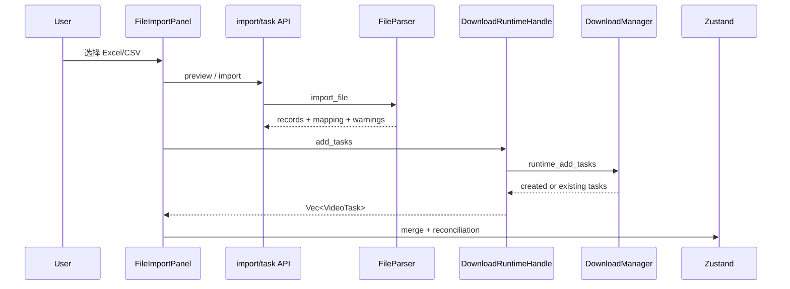
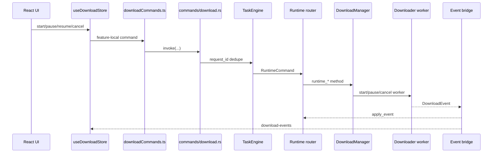
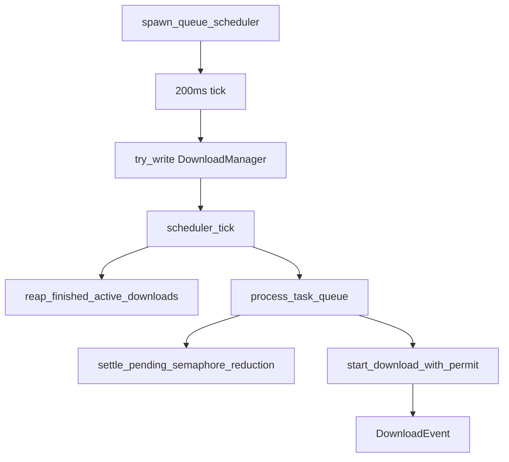
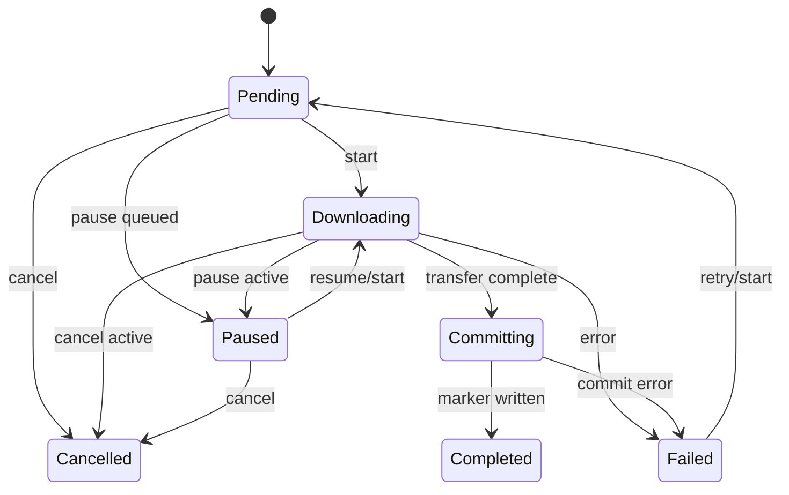

# 大型项目代码库 AI 接手分析报告

- 更新日期：2026-05-06
- 当前基线：`main` /
  `822f387 docs: polish architecture and community onboarding`
- 分析范围：`/Volumes/soft/10-codex/006-tauri-video-batch-downloader`
- 分析方式：本地源码扫描、Graphify 图谱、GitNexus 索引与影响分析、README/文档/CI/GitHub 社区配置复核。

> 本文档面向下一位接手该仓库的 AI
> agent 或工程师。它描述当前 main 的真实状态、主要模块、核心流程、风险区域和建议接手顺序。若与历史设计文档冲突，优先相信
> `README.md`、`docs/architecture-functional-design.md`、`docs/current-state.md`
> 和当前源码。

---

## 1. 执行摘要

Video Downloader Pro 是一个基于 **Tauri v2 + Rust + React 19 + TypeScript**
的跨平台桌面批量视频下载工具。项目核心不是简单 URL 下载，而是：

- Excel/CSV 批量导入任务
- 下载队列和并发调度
- 暂停、恢复、失败重试、断点续传
- M3U8/HLS、HTTP/HTTPS、YouTube 信息与格式相关能力
- App 重启后的任务和断点状态恢复
- 通过 Tauri 事件桥把后端真实状态同步到前端

当前仓库已经完成多轮架构收敛和社区化整理：

- README 已改成面向社区的第一屏入口，包含 badges、功能表、架构图和文档跳转。
- 新增完整架构文档 `docs/architecture-functional-design.md`。
- GitHub 仓库已设置 description、homepage、topics、Issues、Discussions、Wiki、labels 和 issue/PR
  templates。
- 下载事件信道已从非法的 `download.events` 修正为 Tauri v2 合法信道
  `download-events`。
- 启动恢复策略已修正：重启后恢复任务和断点，但不自动偷跑下载。
- 重复导入同一表格时，前端已用 reconciliation 摘要区分新增/已有/完成/可续传/等待/失败任务。

---

## 2. 当前最重要事实

| 主题               | 当前事实                                                                        |
| ------------------ | ------------------------------------------------------------------------------- |
| 真实运行入口       | 前端 `src/main.tsx -> src/App.tsx -> UnifiedView`；后端 `src-tauri/src/main.rs` |
| 下载核心           | `DownloadRuntimeHandle -> DownloadManager -> downloader/resume/m3u8/youtube`    |
| 前端状态主链       | `UnifiedView -> useDownloadStore -> features/downloads/api/state -> Zustand`    |
| 后端事件信道       | `download-events`，不是旧的 `download.events`                                   |
| 任务恢复           | 重启后 `Downloading` 转 `Paused`，清空启动队列，`queue_paused = true`           |
| 导入重复识别       | 前端 `TaskCreationReconciliation` 汇总新增与已有任务                            |
| 当前社区入口       | README、architecture-functional-design、issue templates、PR template 已更新     |
| 当前未跟踪本地文件 | `.claude/`、`CLAUDE.md`、`sqlResult_1.xls`，不要误提交                          |

---

## 3. 技术栈

| 层            | 技术                                | 说明                                     |
| ------------- | ----------------------------------- | ---------------------------------------- |
| Desktop shell | Tauri v2                            | 跨平台窗口、IPC、插件和 bundle           |
| Backend       | Rust 2021、Tokio、Reqwest、Tracing  | 下载调度、文件写入、持久化、日志         |
| Frontend      | React 19、TypeScript、Vite 7        | UI、导入、队列控制、设置                 |
| State         | Zustand v5                          | 前端下载任务与配置状态                   |
| Validation    | Zod + TypeScript contracts          | 前端 schema、事件 envelope、payload 校验 |
| Styling       | Tailwind CSS v4 + shadcn 风格约定   | 深色优先、焦点态和现代桌面 UI            |
| Tests         | Vitest、Testing Library、cargo test | 前后端单元/集成测试                      |
| CI/CD         | GitHub Actions                      | CI、Release、安全审计                    |
| Analysis      | Graphify + GitNexus                 | 架构图谱、符号索引、影响面分析           |

---

## 4. 当前目录结构

```text
.
├── README.md
├── CONTRIBUTING.md
├── AGENTS.md
├── .github/
│   ├── ISSUE_TEMPLATE/
│   ├── pull_request_template.md
│   ├── dependabot.yml
│   └── workflows/
├── docs/
│   ├── architecture-functional-design.md
│   ├── current-state.md
│   ├── index.md
│   ├── app-regression-test-plan-2026-05-06.md
│   └── plans/
├── src/
│   ├── components/
│   ├── features/downloads/
│   ├── schemas/
│   ├── stores/
│   └── utils/
├── src-tauri/
│   ├── capabilities/
│   ├── src/commands/
│   ├── src/core/
│   ├── src/engine/
│   ├── src/infra/
│   └── tauri.conf.json
├── scripts/
└── graphify-out/
```

关键说明：

- `graphify-out/` 是本地图谱输出，通常不入库。
- `.planning/` 如果存在，是本地 GSD 规划上下文，普通提交不要误加。
- `.claude/`、`CLAUDE.md`、`sqlResult_1.xls`
  当前是本地未跟踪文件，除非用户明确要求，否则不要提交。

---

## 5. 前端架构

### 5.1 入口与 UI 主链

```text
src/main.tsx
  -> App
  -> UnifiedView
  -> ManualInputPanel / FileImportPanel / DashboardToolbar
  -> useDownloadStore / configStore
  -> features/downloads/api
  -> Tauri invoke
```

主要组件：

| 模块                                     | 职责                            |
| ---------------------------------------- | ------------------------------- |
| `src/components/Unified/UnifiedView.tsx` | 当前正式主工作台                |
| `ManualInputPanel.tsx`                   | 手动添加 URL                    |
| `FileImportPanel.tsx`                    | Excel/CSV 导入、预览、确认      |
| `StatusBar.tsx`                          | 状态展示                        |
| `DashboardToolbar.tsx`                   | 批量开始/暂停、筛选、刷新、清理 |
| `DownloadStartConfirmDialog.tsx`         | 下载前确认保存位置              |
| `DeleteTasksConfirmDialog.tsx`           | 删除任务确认                    |

### 5.2 Feature-local API

前端生产代码不应到处直接 `invoke`，而应通过：

- `src/features/downloads/api/downloadCommands.ts`
- `src/features/downloads/api/importCommands.ts`
- `src/features/downloads/api/configCommands.ts`
- `src/features/downloads/api/runtimeQueries.ts`
- `src/features/downloads/api/taskCreation.ts`
- `src/features/downloads/api/taskMutations.ts`
- `src/features/downloads/api/systemCommands.ts`

这样可以把 Tauri command 名称、参数、返回值集中管理。

### 5.3 状态与副作用

核心状态容器：

- `src/stores/downloadStore.ts`
- `src/stores/configStore.ts`
- `src/stores/uiStore.ts`

下载 feature 编排层：

- `taskCreationOrchestration.ts`
- `taskCreationState.ts`
- `downloadEventBridge.ts`
- `eventReducers.ts`
- `runtimeSync.ts`
- `batchControlEffects.ts`
- `commandControlEffects.ts`
- `taskMutationEffects.ts`
- `retryFailedEffects.ts`

重要约束：

- React 组件中不要 destructure Zustand store；使用 selector。
- Tauri event listener 和 async callback 中优先使用
  `useDownloadStore.getState()`。
- 前端不要在用户点击暂停时抢先把任务写成 `paused`；应等待后端事件或 refresh。
- 修改事件协议时必须同步 Rust emitter、TypeScript parser 和测试。

---

## 6. 后端架构

### 6.1 后端入口

真实桌面入口是：

```text
src-tauri/src/main.rs
```

启动职责：

1. 初始化 tracing。
2. 构造 `AppState`。
3. 注册 Tauri 插件。
4. 注册 IPC commands。
5. 启动 runtime router。
6. 启动 download event bridge。
7. 启动 download manager 和 queue scheduler。

### 6.2 IPC commands

| 文件                   | 职责                                               |
| ---------------------- | -------------------------------------------------- |
| `commands/download.rs` | 下载任务增删改、开始、暂停、恢复、取消、统计、限速 |
| `commands/import.rs`   | 文件导入、编码检测、预览、格式支持                 |
| `commands/config.rs`   | 配置读写、重置、导入导出                           |
| `commands/system.rs`   | 打开目录、视频信息探测、前端日志落盘               |
| `commands/youtube.rs`  | YouTube 相关能力                                   |

### 6.3 Runtime command router

`src-tauri/src/core/runtime.rs` 提供 `DownloadRuntimeHandle`。它通过 Tokio
`mpsc` + `oneshot` 串行化下载控制命令，避免多个 UI 操作同时直接改
`DownloadManager`。

主要命令：

- `AddTasks`
- `UpdateTaskOutputPaths`
- `RemoveTasks`
- `ClearCompleted`
- `RetryFailed`
- `UpdateConfig`
- `SetRateLimit`
- `Start` / `Pause` / `Resume` / `Cancel`
- `StartAll` / `PauseAll`
- `ApplyEvent`

### 6.4 DownloadManager

`DownloadManager` 仍是 Graphify 识别出的最大核心抽象。它负责：

- `tasks`
- `active_downloads`
- `download_semaphore`
- `task_queue`
- `queue_paused`
- `stats`
- `rate_limit`
- `progress_tracker`
- `integrity_checker`
- `retry_executor`
- `task_lifecycle_timings`
- `youtube_downloader`
- `scheduler_handle`

当前已经拆出的子模块：

- `manager/state.rs`：状态流转规则
- `manager/queue.rs`：队列入队、出队、补位和 semaphore 收敛
- `manager/stats.rs`：统计聚合和生命周期指标
- `manager/identity.rs`：任务身份、输出路径、重复识别、resume key
- `manager/integrity.rs`：完整性校验
- `manager/events.rs`：事件发送辅助

后续继续拆 `DownloadManager` 时，应沿这些现有边界小步移动，不要重写主链。

### 6.5 下载执行器

| 模块                    | 职责                                        |
| ----------------------- | ------------------------------------------- |
| `downloader.rs`         | HTTP 下载、连接、重试、进度                 |
| `resume_downloader.rs`  | Range/chunk 断点续传、resume metadata       |
| `m3u8_downloader.rs`    | HLS playlist、segment、key/IV 解析          |
| `youtube_downloader.rs` | YouTube URL、视频信息、格式选择             |
| `part_file.rs`          | `.part` 文件预分配、范围写入、commit rename |
| `integrity_checker.rs`  | hash 和完整性校验                           |
| `progress_tracker.rs`   | 速度、ETA、统计窗口                         |

---

## 7. 核心业务流程

### 7.1 导入与任务创建



当前重复导入处理：

- 新任务进入列表。
- 已有任务不重复创建。
- 前端消息会展示新增、已有、已完成、可续传、等待、失败数量。

### 7.2 单任务下载控制



### 7.3 队列调度



并发策略：

- 并发调高时，如果队列未暂停，后续 tick 会补位。
- 并发调低时，不强杀正在跑的任务，而是延迟收敛 semaphore。
- 队列暂停时不自动调度。

---

## 8. 任务状态机



关键语义：

- `Downloading` 和 `Committing` 是活跃状态，不能重复 start。
- `Completed` 和 `Cancelled` 是终态。
- `Failed` 可 retry。
- `Committing` 保护文件最终落盘阶段。
- 启动恢复时，遗留 `Downloading` 会转为 `Paused`。

---

## 9. 持久化与恢复

本地状态实体：

| 实体                    | 说明              |
| ----------------------- | ----------------- |
| `VideoTask`             | 下载任务          |
| `DownloadConfig`        | 下载配置          |
| `AppConfig`             | 应用配置总根      |
| `PersistedManagerState` | manager 本地状态  |
| `download_state.json`   | 任务与队列状态    |
| `.part`                 | 未完成下载内容    |
| resume snapshot         | 断点续传 metadata |
| `.vdstate`              | 完成 marker       |
| `config.json`           | 用户配置          |

当前启动恢复策略：

1. 读取 persisted manager state。
2. `Downloading -> Paused`。
3. 启动时不恢复旧队列，也不把 pending 自动入队。
4. 如果有可恢复任务，`queue_paused = true`。
5. hydrate 本地文件状态和完成 marker。
6. 用户明确点击开始后，才重新排队/恢复下载。

这条策略已经通过 Rust 测试和真实 App 回归验证。

---

## 10. 事件与状态同步

### 10.1 后端事件

事件统一通过：

```text
src-tauri/src/infra/event_bus.rs
```

当前信道：

```text
download-events
```

事件 envelope：

| 字段             | 说明                                                             |
| ---------------- | ---------------------------------------------------------------- |
| `schema_version` | 当前为 `1`                                                       |
| `event_id`       | UUID                                                             |
| `event_type`     | `task.progressed` / `task.status_changed` / `task.stats_updated` |
| `ts`             | RFC3339 时间                                                     |
| `payload`        | 事件载荷                                                         |

### 10.2 前端消费

前端事件桥：

```text
src/features/downloads/state/downloadEventBridge.ts
```

职责：

- `listen('download-events')`
- 校验 envelope
- 校验 payload
- progress 事件节流
- status 事件 reducer
- stats 事件合并
- runtime sync fallback

任何事件协议变更必须同步：

- Rust `event_bus.rs`
- Rust `download_event_bridge.rs`
- TS `model/contracts.ts`
- `downloadEventBridge.test.ts`
- `contracts.test.ts`

---

## 11. Graphify / GitNexus 当前状态

### GitNexus

`AGENTS.md` 当前记录：

```text
4795 symbols / 9139 relationships / 300 execution flows
```

GitNexus staged 文档变更分析在最近一次文档更新中为 low
risk，未发现受影响执行流。

需要重点使用 GitNexus impact 的区域：

- `DownloadManager`
- `load_persisted_state`
- `runtime_start_download`
- `spawn_download_event_bridge`
- `DownloadRuntimeHandle`
- `manager/identity.rs`
- `FileImportPanel`
- `taskCreationState.ts`

### Graphify

当前 `graphify-out/GRAPH_REPORT.md` 记录：

```text
1520 nodes / 2743 edges / 67 communities
```

God nodes：

1. `DownloadManager`
2. `YoutubeDownloader`
3. `HttpDownloader`
4. `PerformanceBenchmark`
5. `FileParser`
6. `ResumeDownloader`
7. `M3U8Downloader`
8. `DeploymentVerifier`
9. `EncodingDetector`
10. `DownloadRuntimeHandle`

工具限制：

- 当前本机 `graphify` CLI 暴露 `query/save-result/benchmark/install/hook`
  等命令。
- 当前 CLI 不暴露完整 semantic rebuild/update 命令。
- `./scripts/graphify-sync.sh smart` 可做 code graph
  rebuild 或提示文档/媒体变化需要完整刷新。

---

## 12. 中间件、数据库与部署

### 数据库

未发现业务数据库、ORM、migration 或 SQL
schema。当前持久化是本地 JSON + 文件系统 marker。

### 外部中间件

未使用 Redis、Kafka、RabbitMQ、Nacos、XXL-JOB、Elasticsearch。

内部消息机制：

- Tokio `mpsc` / `oneshot`：download runtime command router。
- Tauri event：后端向前端发送 `download-events`。

### 部署

不是 Web 服务部署模型；主要发布方式是 Tauri desktop bundle：

- macOS `.app` / `.dmg`
- Windows `msi/nsis`
- Linux 根据 Tauri bundle 配置
- GitHub Actions `release.yml`

---

## 13. 当前质量门禁

推荐提交前至少跑：

```bash
pnpm type-check
pnpm lint
pnpm exec vitest run
cargo fmt --manifest-path src-tauri/Cargo.toml --all --check
cargo clippy --manifest-path src-tauri/Cargo.toml -- -D warnings
cargo test --manifest-path src-tauri/Cargo.toml
pnpm build
```

下载核心变更还应跑真实 App 回归，尤其：

- 导入 `sqlResult_1.xls`
- 重复导入同表
- 修改并发
- 开始少量任务
- 暂停/恢复
- 关闭重开
- 验证重开后不自动下载

完整回归方案见：

```text
docs/app-regression-test-plan-2026-05-06.md
```

---

## 14. 当前风险和债务

| 风险                                  | 当前判断                                                   |
| ------------------------------------- | ---------------------------------------------------------- |
| `DownloadManager` 仍偏大              | 已拆出若干子模块，但仍是最大核心抽象，修改需谨慎           |
| `downloadStore.ts` 仍是前端运行时容器 | 已有 feature-local state/action 拆分，仍需继续瘦身         |
| 事件 + refresh + polling 并存         | 当前是稳妥同步策略，后续可继续收敛                         |
| Tauri capability 扩展易漏配           | 新增 plugin command 时必须同步 capability                  |
| 外部工具能力不确定                    | `yt-dlp`/`ffmpeg` 等应经 capability service 探测           |
| `cargo audit` 上游 warning            | 主要来自 Tauri/wry Linux GTK3 依赖链，不是业务代码直接漏洞 |
| 完成识别仍依赖 marker                 | 后续可引入可选 ETag/hash/Content-Length 校验               |

---

## 15. GitHub 社区化状态

当前已经完成：

- README badges、功能表、架构图、文档入口。
- GitHub description 和 homepage。
- Topics：`tauri`、`rust`、`react`、`typescript`、`video-downloader`、`batch-download`、`download-manager`、`desktop-app`、`m3u8`、`hls`、`resumable-downloads`、`excel-import`。
- Issues / Discussions / Wiki 已开启。
- Labels：`needs-triage`、`protocol`、`download-core`、`import`、`documentation`
  等。
- Issue templates：bug、feature、site/protocol support。
- PR template：质量门禁和下载专项 checklist。

后续社区优化建议：

- 补 license。
- 增加截图或短视频 demo。
- 增加 release notes 模板。
- 补充 Windows/Linux 实机截图和安装说明。
- 加一个 `good first issue` 路线图。

---

## 16. 新人 7 天接手计划

| 天数  | 目标               | 建议动作                                                                                                  |
| ----- | ------------------ | --------------------------------------------------------------------------------------------------------- |
| Day 1 | 跑通环境与文档入口 | 阅读 `README.md`、`docs/index.md`、`docs/architecture-functional-design.md`、本报告；跑 `pnpm type-check` |
| Day 2 | 理解前端主链       | 阅读 `UnifiedView`、`FileImportPanel`、`DashboardToolbar`、`downloadStore.ts`、`features/downloads/api/*` |
| Day 3 | 理解后端主链       | 阅读 `main.rs`、`commands/download.rs`、`core/runtime.rs`、`core/manager.rs` 和 manager 子模块            |
| Day 4 | 下载状态机专项     | 聚焦 `TaskStatus`、start/pause/resume/cancel、queue scheduler、event bridge、持久化恢复测试               |
| Day 5 | 导入与身份专项     | 阅读 `commands/import.rs`、`file_parser.rs`、`manager/identity.rs`、`taskCreationState.ts`                |
| Day 6 | 真实回归           | 用 `sqlResult_1.xls` 做导入、重复导入、并发、暂停、关闭重开测试                                           |
| Day 7 | 小闭环贡献         | 选文档、测试、UI 文案或低风险 helper，提交前跑 GitNexus detect_changes 和对应测试                         |

---

## 17. 后续优化建议

1. 继续拆 `DownloadManager`，优先拆 persistence、worker launcher、queue
   policy、provider adapters。
2. 继续瘦身 `downloadStore.ts`，让它更像 facade。
3. 为无 Range、HTTP 429、断网、磁盘权限、文件损坏补更系统的测试。
4. 给 `download_state.json` 增加 schema version，为未来状态迁移做准备。
5. 对 `yt-dlp`、`ffmpeg` 做 sidecar/capability 统一治理。
6. 把完成识别从 `.vdstate` 扩展到可选 ETag/hash/Content-Length。
7. 对 Windows/Linux 做完整 release smoke test。
8. 增加社区 demo 资产和 license。

---

## 18. 接手结论

这个仓库的真实复杂度集中在：

1. **下载状态机**
2. **并发队列**
3. **本地持久化与断点续传**
4. **Tauri IPC 与事件同步**
5. **批量导入与任务身份**

修改优先级建议：

- 只改文档/README/模板：风险低，跑格式检查和 GitNexus staged 即可。
- 改前端导入/状态：跑 Vitest 相关测试和真实导入。
- 改事件协议：同步 Rust/TS contracts，并跑事件桥测试。
- 改下载核心：先写 Rust 测试，再跑 full gate 和真实 App。

下一位接手者应先守住这三条主线：

```text
Frontend: UnifiedView -> useDownloadStore -> features/downloads/api/state
Backend: commands/download.rs -> TaskEngine -> runtime.rs -> DownloadManager
Events: DownloadManager -> download_event_bridge -> download-events -> downloadEventBridge.ts -> Zustand
```

只要这三条线稳定，项目就可以继续小步扩展协议、平台和社区体验。
